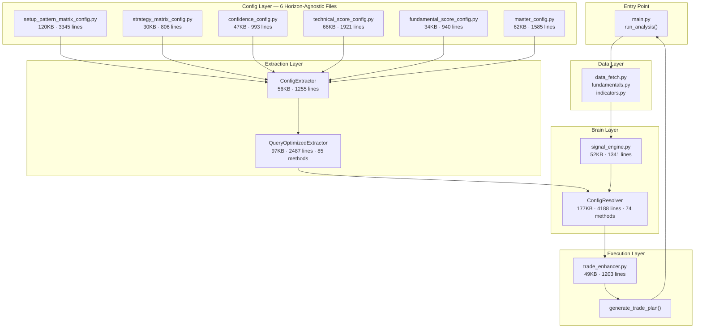
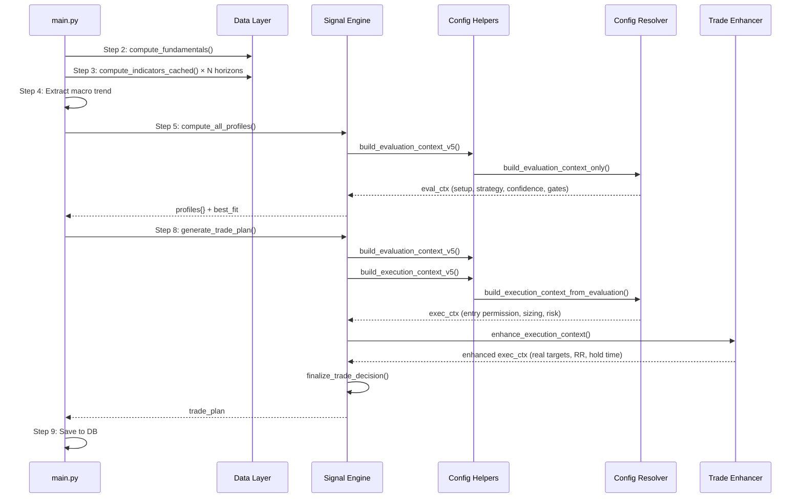

# 📈 Pro Stock Analyzer & Trading Engine

An institutional-grade **Algorithmic Trading System** built with a **Hybrid Data Architecture** for the Indian Market (NSE). A modular, end-to-end **Stock Analysis + Trade Decision System** built using FastAPI, AG Grid, pandas, yfinance, and custom scoring logic. This fully modular engine combines high-frequency technical analysis, fundamental screening, and a **Pattern-Aware Trade Intelligence Layer** to generate actionable trade plans.

The system processes a stock from **Raw OHLCV → Actionable Trade Plan** using a multi-layer decision pipeline typically found on proprietary trading desks.

> **Core Philosophy:** Most scanners only look at indicators. This engine understands **Market Structure**. Price does not move randomly—it follows geometry (Cup depth, Flag poles, Box ranges). This engine quantifies that geometry.

---

## 🚀 Key Differentiators

### **1. Unified Configuration Architecture**
* **Single Source of Truth:** All config parameters are split into 6 horizon-agnostic files defining the system's fixed rules.
* **Pattern-Config Injection:** Each pattern receives horizon-aware config (e.g., VCP lookback adapts from 50 days to 50 weeks).
* **Zero Desync Risk:** Eliminates scattered magic numbers across modules.

### **2. Pattern Lifecycle Management**
* **Age Tracking:** Every pattern returns `age_candles` and `formation_timestamp` in metadata.
* **Stateful Invalidation:** Database-backed breakdown tracking (e.g., Darvas box breakdown duration).
* **Stale Pattern Detection:** Automatic expiry of old formations (prevents trading 30-day-old Cup & Handles).

### **3. Hybrid Data Architecture**
* **Polymorphic Indicators:** Automatically switches math based on horizon (e.g., Intraday uses `ATR(10), EMA (20/50/200)`, Short-Term uses `ATR(14), EMA (20/50/200)`, Long-Term uses `ATR(20), WMA (10/40/50)` Multibagger uses `ATR(12)` | MMA (6/12/12)).
* **3-Tier Caching:** RAM -> Parquet (Data Lake) -> Yahoo Finance.
* **Zero-Cost Corp Actions:** Scrapes Equitymaster for upcoming dividends/splits to avoid API costs.

### **4. Pattern Recognition Engine (The "Eyes")**
The system includes a dedicated detection layer that identifies 9 specific institutional setups:
* **Breakout:** Cup & Handle (O'Neil), Darvas Box, Bull Flag/Pennant.
* **Volatility:** Minervini VCP (Volatility Contraction), Bollinger Squeeze.
* **Trend:** Golden/Death Cross, Ichimoku Cloud/TK Cross.
* **Reversal:** Double Top/Bottom, Three-Line Strike.

### **5. Geometric Trade Planning**
It overrides generic ATR targets with **Pattern Geometry**:
* **Smart Targets:** If a "Cup & Handle" is found, T1 is calculated based on `Rim + 0.618 × Depth`.
* **Dynamic Stops:** Stops are auto-tuned based on Volatility Personality.
* **Pattern-Aware Time:** Uses "Pattern Physics" to estimate holding time.

---

## 🏗️ High-Level Architecture



---

## 🧠 The 4-Layer Processing Pipeline

### Layer 1: Config Files (The Heart)

Six **horizon-agnostic** config files define the system's fixed rules inside `config/`:

| File | Role | Key Exports |
|------|------|-------------|
| `setup_pattern_matrix_config.py` | Setup↔Pattern affinity, validation modifiers | `SETUP_PATTERN_MATRIX` (~18 setups) |
| `strategy_matrix_config.py` | Strategy DNA: scoring rules, market cap filters | `STRATEGY_MATRIX` (~10 strategies) |
| `confidence_config.py` | Confidence calculation modifiers | `CONFIDENCE_CONFIG` |
| `technical_score_config.py` | Technical indicator scoring (40+ metrics) | `METRIC_REGISTRY` + scoring fns |
| `fundamental_score_config.py`| Fundamental metric scoring overrides | `METRIC_REGISTRY` + `HORIZON_FUNDAMENTAL_WEIGHTS` |
| `master_config.py` | Horizon-specific overrides, gates, execution rules | `MASTER_CONFIG` (wraps everything) |

### Layer 2: Extraction (Config → Query API)

#### `ConfigExtractor` (`config_extractor.py`)
Pre-extracts all config sections at initialization into typed `ConfigSection` objects.

#### `QueryOptimizedExtractor` (`query_optimized_extractor.py`)
Wraps `ConfigExtractor` with **85 type-safe query methods**, organized in 7 categories (Confidence, Gates, Patterns, Strategy, Scoring, Normalization, Utility).

### Layer 3: Resolution & Scoring (The Brain)

#### `ConfigResolver` (`config_resolver.py`)
The **brain** of the application containing 4188 lines and 74 methods with two main public APIs:
1. `build_evaluation_context_only()` — Phase 1: Pure analysis (no capital/time dependency)
2. `build_execution_context_from_evaluation()` — Phase 2: Execution projection

**Evaluation Pipeline (8 Internal Phases):**
1. Flatten Indicators
2. Trend & Momentum Context
3. Score Calculation (tech + fundamental + hybrid)
4. Setup Classification (evaluate all 18 setups)
5. Strategy Classification
6. Confidence Calculation (Base floor → ADX bands → clamp)
7. Gate Validation (Structural, execution, opportunity)
8. Risk Candidates (SL, targets, RR ratio)

#### `signal_engine.py` (The Orchestrator)
Triggers the resolver by looping over horizons, blending technical/fundamental pillars, classifying profiles, and finally generating the trade plan.

### Layer 4: Execution (Targets, Hold Times, Enhancement)

#### `trade_enhancer.py`
Post-processes the execution context natively with 5 continuous phases:
1. `adjust_targets_for_market_conditions()`
2. `get_rr_regime_multipliers()`
3. `check_pattern_expiration()`
4. `check_pattern_invalidation()`
5. `enhance_execution_context()`

Includes `calculate_pattern_timeline()` to estimate realistic hold times.

---

## 🔄 Complete Data Flow: `run_analysis()`

The exact 10 steps happening inside `main.py`:



---

## 📚 Pattern Library (Supported Setups)

| Pattern | Type | Timeframe | Speed Factor | Age Tracking |
|:---|:---|:---|:---|:---|
| **Minervini VCP** | Volatility Contraction | Swing | **1.8x** (Explosive) | ✅ Contraction start |
| **Cup & Handle** | Accumulation | Long Term | **1.2x** (Measured) | ✅ Left rim formation |
| **Darvas Box** | Trend Continuation | Swing | **1.3x** (Fast) | ✅ Box consolidation start |
| **Bollinger Squeeze** | Volatility Breakout | Intraday/Daily | **1.5x** (Fast) | ⚠️ Estimated (7-day) |
| **Golden Cross** | Regime Change | Long Term | **0.8x** (Slow Grind) | ✅ Crossover bar |
| **Double Bottom** | Reversal | Swing | **0.9x** (Structural) | ✅ First trough |
| **Three-Line Strike** | Reversal | Short Term | **2.5x** (Violent) | ✅ Always fresh (1 bar) |
| **Flag/Pennant** | Continuation | Swing | **1.4x** (Fast) | ✅ Pole start |
| **Ichimoku Signal** | Trend Entry | All | **1.1x** (Steady) | ✅ TK cross (fresh=1) |

---

## 🧩 Smart Workflows

### **1. 3-Tier Caching Strategy**
Implemented in `data_fetch.py` to ensure sub-millisecond response times:
1.  **L1 (RAM):** Instant access using `LRUCache` (TTL: 15m Intraday / 6h Daily).
2.  **L2 (Disk/Parquet):** Persistent storage handled by `ParquetStore`.
3.  **L3 (Source API):** Yahoo Finance (only hit if L1 and L2 miss).

### **2. Smart Benchmarking**
- **Auto-Detection:** The system automatically maps stocks to their "Home Index" (e.g., `INFY` → `Nifty IT`, `SUZLON` → `Smallcap 100`).
- **Relative Strength:** Calculates performance against the *relevant* benchmark.

### **3. Corporate Actions Architecture**
- **BULK MODE:** Uses ONLY **Equitymaster** (Zero YFinance calls). Safe for scanning 1500+ symbols.
- **SINGLE-STOCK MODE:** When analyzing a specific stock, fetches detailed history via Yahoo and caches it in JSON.

---

## 💻 Dashboard Features

### **Index View (`index.html`)**
- **Confluence Dots:** Visual "Traffic Light" (● ● ●) showing alignment across Intraday/Swing/Long-Term.
- **Actionable Columns:** Shows **R:R Ratio**, **Risk %**, and **Setup Type** badges (🚀, 📉).
- **Live Filtering:** Sort by "Squeeze", "Trend", or specific Score thresholds.

### **Details View (`result.html`)**
- **Profile Switcher:** Toggle between **Intraday** (Scalp) and **Long Term** (Invest) scoring logic instantly.
- **Transparency:** "Top Drivers" table shows exactly *which* indicators boosted the score.
- **Risk Management:** Integrated sticky footer calculator for position sizing based on Stop Loss.
- **Paper Trading:** Seamless button to log trades to the paper portfolio directly from the results page.

---

## � Detailed File Responsibilities

### 1. The Core Engine (The Brain)
| File | Responsibility |
|------|----------------|
| `services/signal_engine.py` | **The Orchestrator.** Loops over timeframes, triggers indicator calculation, evaluates score logic, and builds the raw mathematical profile. |
| `services/trade_enhancer.py` | **The Execution Planner.** Converts raw signals into actionable trades. Calculates exact Stop Loss arrays, dynamic Take Profits based on pattern geometry, and evaluates hold times. |
| `main.py` | **The Web Controller.** FastAPI application entry point. Serves HTML templates, exposes API endpoints (/analyze, /quick_scores), and handles incoming user requests. |

### 2. Config Extraction & Resolution
| File | Responsibility |
|------|----------------|
| `config/config_resolver.py` | **The Evaluation Workhorse.** Massive 8-phase pipeline that merges stock data with configured strict gates, outputting technical + fundamental confluence scores. |
| `config/query_optimized_extractor.py` | **Type-Safe API.** Exposes 85+ robust getter methods to extract specific rule constraints (e.g., Minervini threshold) perfectly without dictionary lookups. |
| `config/config_extractor.py` | **The Raw Parser.** Interprets the multi-layered Python dictionaries from the config definition files, turning them into standardized objects. |
| `config/config_validators.py` | **Integrity Checker.** Runs validations against the config schemas at startup to prevent incorrect values from breaking the engine at runtime. |

### 3. Rules & Parameters (Configuration Layer)
| File | Responsibility |
|------|----------------|
| `config/master_config.py` | Global wrapper managing risk profile variables and broad system rules. |
| `config/setup_pattern_matrix_config.py` | Maps required geometric patterns and strict validation rules to specific Setup logic (e.g., Breakout requires Triangle/VCP). |
| `config/strategy_matrix_config.py` | Evaluates stock DNA to categorize it into styles: CANSLIM, Swing, Long-term, Scalp. |
| `config/technical_score_config.py` | Registry of 40+ TA indicators with custom dynamic scoring weights per horizon. |
| `config/fundamental_score_config.py` | Defines exactly which financial metrics matter and how to parse them. |
| `config/constants.py` | Contains system constants, magic numbers, string enums, and default paths. |
| `config/market_utils.py` | Centralizes timezone parsing, enforcing uniform IST (Indian Standard Time) datetimes system-wide. |

### 4. Data Acquisition & Storage
| File | Responsibility |
|------|----------------|
| `services/data_fetch.py` | **L3 Fetcher.** Queries Yahoo Finance for OHLCV bars. Prevents API bans and routes responses to local caches. |
| `services/fundamentals.py` | Grabs, validates, and calculates trailing corporate financial statements (PE, ROE, Margins) avoiding redundant HTTP requests. |
| `services/corporate_actions.py` | Web-scrapes Equitymaster for zero-cost upcoming dividend, bonus, and split announcements. |
| `services/data_layer.py` | **Parquet Lakehouse I/O.** Extremely fast reading/writing of massive Pandas time-series arrays using PyArrow integration. |
| `services/db.py` | **SQLAlchemy Manager.** Handles SQLite persistence for calculated signals so dashboard reloads are instant. |
| `services/indicator_cache.py` | Memory buffer layer retaining compiled indicator arrays locally for rapid subsequent reuse during loops. |

### 5. Technical Mathematics
| File | Responsibility |
|------|----------------|
| `services/indicators.py` | **The Math Engine.** Implements Pandas-TA to rapidly calculate 30+ indicators including ATR, MACD, Ichimoku, and Supertrend. |
| `services/indicator_signals.py` | Reads raw array values and parses them into explicit boolean triggers (e.g., True if RSI > 70). |
| `services/patterns/` (Directory) | Contains isolated detection logic like `darvas.py` and `minervini_vcp.py` to recognize geometrical structures. |

---

## 📦 Installation

```
pip install -r requirements.txt
```

### **Start server**
```
uvicorn main:app --reload
```

### **Access UI**
```
http://localhost:8000
```

---

## 🧠 Logic Deep Dive

The engine uses a deterministic, priority-driven decision framework to classify market setups, validate execution conditions, and generate a geometric, risk-aware trade plan.

### **1. Signal Classification Engine (Priority Queue)**
The classifier processes all possible setups in descending priority. The **first matching condition** becomes the active signal.

* **🚀 Momentum Breakout (Highest Priority)**
    * **Logic:** `Price > BB Upper` AND `RSI > 60` AND `RVOL > 1.5×` AND `Trend Strength > 6`.
    * **Context:** Used for explosive upside events only.
* **🎯 Volatility Squeeze**
    * **Logic:** Bollinger Bands inside Keltner Channels (`TTM Squeeze = ON`).
    * **Context:** Signals volatility contraction before expansion; direction is decided post-breakout.
* **💎 Quality Accumulation**
    * **Logic:** `Price in Lower BB Half` AND `ADX < 30` (Ranging) AND `Fundamentals Strong` (PE < 25, ROE > 12%).
    * **Context:** Used for long-term value accumulation candidates.
* **📘 Trend Pullback**
    * **Logic:** `Price > 200 EMA` (Uptrend) AND `Price near 20/50 EMA` AND `RSI > 50`.
    * **Context:** Standard continuation-pullback entry.
* **📈 Trend Following**
    * **Logic:** `20 EMA > 50 EMA > 200 EMA` (Perfect Alignment) AND `MACD Hist > 0`.
    * **Context:** Used when the trend is fully mature.

### **2. Accumulation Mode (Smart Money Logic)**
Designed to detect **multibagger-grade accumulation bases** despite weak short-term signals.

* **Fundamental Gate:** `PE < 25`, `ROE > 12%`, `EPS Growth > 0`.
* **Technical Gate:** `Price > BB Lower Band`, `Price < BB Mid × 1.02`, `ADX < 30`.
* **Action:** Generates **BUY_ACCUMULATE** with staged position sizing.

### **3. Entry Guards & Safety Filters**
Every potential trade is validated through multiple protective layers.

* **🟦 Macro Trend Guard:** If NIFTY Trend = Bearish, reduce long confidence by **15%**.
* **🟥 Supertrend Guard:**
    * Longs blocked when `Price < Supertrend Bearish` (unless Breakout).
    * Shorts blocked when `Price > Supertrend Bullish` (unless Breakdown).
* **🟨 Volatility Guard:**
    * `ATR% > 4%` → Reject trade (except Breakouts).
    * `Volatility Quality < 4` → Avoid choppy markets.

### **4. Best Horizon Selection (Profile Competition)**
The engine computes and scores all horizons simultaneously:
* Intraday (15m)
* Short-Term (Daily)
* Long-Term (Weekly)
* Multibagger (Monthly)

**Selection Example:**
* Intraday: 4.5
* **Short Term: 8.2 (Selected)**
* Long Term: 6.0
* Multibagger: 5.4

The **highest-scoring profile** becomes the active view on the dashboard.

### **5. Trade Plan Construction (Geometric Planning)**

* **🎯 Entry Permission Framework:**
    * **Breakouts:** Require ≥70% confidence.
    * **Squeezes:** Require ≥65% confidence.
    * **Pullbacks:** Require ≥55% confidence + `Trend Strength ≥ 5`.
* **🔻 Stop-Loss Geometry:**
    * **Base SL:** `Entry − (ATR × SL_MULT)`.
    * **Supertrend Clamp:** Uses ST if tighter.
    * **PSAR Tightening:** Uses PSAR if tighter.
    * **Noise Filter:** SL must be `≥ 0.5× ATR` away.
* **🎯 Target Calculation:**
    * **T1:** `Entry + (1.5 × Risk)`.
    * **T2:** `Entry + (ATR × TP_MULT)`.
* **📏 Pattern Overrides:**
    * **Cup & Handle:** Rim depth projection.
    * **Darvas Box:** Box height projection.
    * **Flag/Pennant:** Pole height projection.
* **📊 Risk/Reward Enforcement:**
    * **Intraday:** 1:1.5
    * **Swing:** 1:2
    * **Long-Term:** 1:2.5
    * *Trades failing RR floor are rejected.*

### **6. Volatility & Volume Controls**

* **Volatility Rules:**
    * Excessively high ATR% = Dangerous.
    * Low Volatility Quality = Chop (Avoid).
* **Volume Rules:**
    * **Breakouts:** Require strong RVOL.
    * **Breakdowns:** Require RVOL ≥ 1.0.
    * **Pullbacks:** Allow low RVOL (healthy consolidation).
* **Supertrend Proximity:**
    * Avoid longs directly under bearish ST.
    * Avoid shorts directly over bullish ST.

### **7. Setup Confidence Model (0–100%)**
Final Confidence = **Trend + Momentum + Volume ± Macro Adjustment**

* **Trend Component:**
    * Above 200 EMA → **+20**
    * Above 50 EMA → **+10**
    * Supertrend Alignment → **+10**
    * Trend Strength Tiers
* **Momentum Component:**
    * MACD Histogram Positive
    * RSI Slope Positive
    * Above VWAP
    * Breakout Bonus
* **Volume Component:**
    * RVOL Tiers
    * OBV Confirmation
    * Volume Spike Detection
* **Final Adjustments:**
    * Macro Penalty (if Bearish Index)
    * Setup Boost (VCP, Breakout, Squeeze)
    * *Confidence is clipped to 0–100% range.*