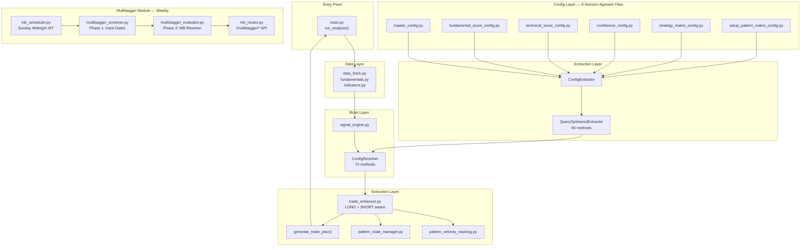
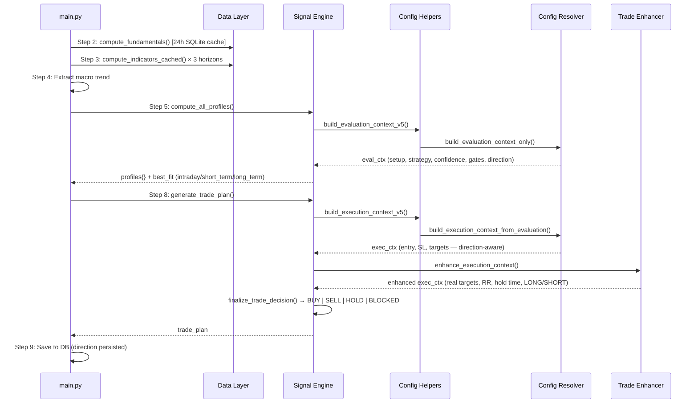
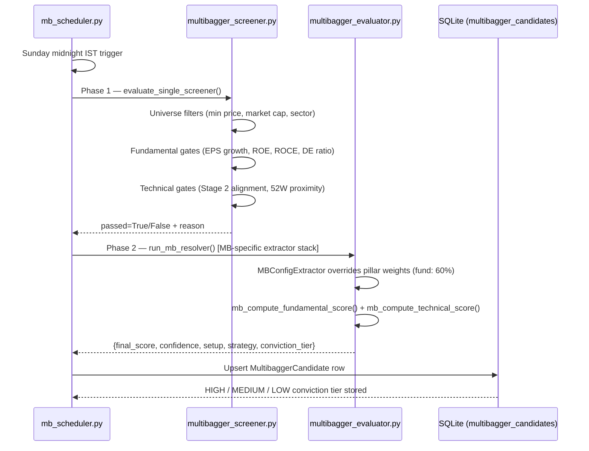

# 📈 Pro Stock Analyzer & Trading Engine

An institutional-grade **Algorithmic Trading System** built with a **Hybrid Data Architecture** for the Indian Market (NSE). A modular, end-to-end **Stock Analysis + Trade Decision System** built using FastAPI, AG Grid, pandas, yfinance, and custom scoring logic. The system processes a stock from **Raw OHLCV → Actionable Trade Plan** using a multi-layer decision pipeline typically found on proprietary trading desks.

---

## 🚀 Key Differentiators

### **1. Unified Configuration Architecture**
- **Single Source of Truth:** All config parameters live in 6 horizon-agnostic files inside `config/` defining the system's fixed rules.
- **Pattern-Config Injection:** Each pattern receives horizon-aware config (e.g., VCP lookback adapts from 50 days to 50 weeks).
- **Zero Desync Risk:** Eliminates scattered magic numbers across modules.

### **2. Bidirectional Signal Engine (LONG + SHORT)**
- **Full Short Support:** `MOMENTUM_BREAKDOWN` and `BEAR_TREND_FOLLOWING` setups generate `SELL` signals with direction-aware SL (above entry), inverted targets (below entry), and correct RR geometry.
- **Automatic Direction Detection:** `trade_enhancer.py` auto-detects LONG/SHORT from SL position — no flag required.
- **SHORT Invalidation:** Config-driven breakdown tracking monitors both long and short positions for early exit conditions.

### **3. Specialized Multibagger Pipeline**
- **Dedicated Weekly Cycle:** Isolated module (`config/multibagger/`) runs independently of the main 3-horizon loop every Sunday midnight IST.
- **Two-Phase Screening:** Phase 1 hard-gates (fundamental + technical filters) followed by Phase 2 deep MB resolver using MB-specific extractor stack.
- **Conviction Tiers:** HIGH (score ≥ 8.5, conf ≥ 75%) / MEDIUM (≥ 7.5, ≥ 65%) / LOW (≥ 6.5, ≥ 60%).
- **Persisted Intelligence:** Each candidate stores `estimated_hold_months` and the exact `entry_trigger` (pattern) in the database.
- **Shared Fundamental Cache:** MB pipeline reuses the same 24-hour `FundamentalCache` SQLite table as the main flow — zero duplicate yfinance calls.

### **4. Multi-Factor Score Synergy**
- Combines Technical (price/volume), Fundamental (ratios/growth), and Hybrid (proprietary cross-pillar) pillars into a unified confidence score per horizon.
- Pillar weights shift by horizon: Intraday is 70% technical, Long-Term is 40% fundamental, Multibagger is 60% fundamental.

### **5. Pattern Lifecycle Management**
- **Age Tracking:** Every pattern returns `age_candles` and `formation_timestamp` in metadata.
- **Stateful Invalidation:** Database-backed breakdown tracking (e.g., Darvas box breakdown duration) for both LONG and SHORT positions.
- **Stale Pattern Detection:** Automatic expiry of old formations (prevents trading 30-day-old Cup & Handles).

### **6. Hybrid Data Architecture**
- **Polymorphic Indicators:** Automatically switches math based on horizon — Intraday uses `EMA(20/50/200) + ATR(10)`, Short-Term uses `EMA(20/50/200) + ATR(14)`, Long-Term uses `WMA(10/40/50) + ATR(20)`, Multibagger (MB module) uses `MMA(6/12/24) + ATR(12)`.
- **3-Tier Caching:** RAM → Parquet (Data Lake) → Yahoo Finance.
- **Zero-Cost Corp Actions:** Scrapes Equitymaster for upcoming dividends/splits to avoid API costs.

> **Core Philosophy:** Most scanners only look at indicators. This engine understands **Market Structure**. Price does not move randomly — it follows geometry (Cup depth, Flag poles, Box ranges). This engine quantifies that geometry and applies it equally to both long and short setups.

---

## 💎 v15.0 High-Transparency & Robust Architecture

The v15.0 release finalizes the **Quant System** with deep synchronization between the main pipeline and specialized modules.

### **1. Dual-Stage Validation Pipeline**
- **Stage 1 (Eligibility/Opportunity)**: Establishes a structural ATR-based baseline. Gating here is broad and structural (e.g., "Is there enough room to move?").
- **Stage 2 (Execution/Refinement)**: Injects pattern geometry and market-adaptive target refinement.
- **Robust Hardware-Blocks**: Fixed logic in `config_resolver.py` to ensure that structural hard-blocks (permissions, capital, spread) are non-overrideable, preventing unsafe entries.

### **2. Selective & Deferred Gating**
To prevent tactical constraints (like a tight RR on a pattern) from damaging the indicative quality score of a stock, the engine now supports **Deferred Gating**. Certain gates (like `rrRatio`) are skipped in Stage 1 if a compatible pattern setup is detected, ensuring the stock's "Quality" is accurately represented while the "Entry Timing" is handled by the specialized pattern geometry later.

### **3. Synchronized Multibagger Synergy**
- **Unified Indicator Physics**: Phase 2 MB Evaluator now uses the exact same `MMA(6/12/24)` anchor as the main pipeline, ensuring zero-desync between screening and evaluation.
- **Hybrid Metric Recovery**: Restored `volatilityAdjustedRoe` and `volatilityQuality` to the MB pillar composition, providing a 360° view of risk-adjusted returns for long-term compounders.

### **4. Semantic Signal Profiling**
Trade signals are no longer just a confidence percentage. They are semantically classified into four regimes:
- **Structural Quality**: Sustained trends backed by institutional fundamentals.
- **Trend Momentum**: Exploiting strong price action velocity.
- **Momentum Burst**: Tactical, short-lived opportunities from volume/squeeze events.
- **Generic**: Standard setup-driven signals.

---

## 🏛️ System Architecture



---

## 🧠 The 4-Layer Processing Pipeline

### Layer 1: Config Files (The Heart)

Six **horizon-agnostic** config files define the system's fixed rules inside `config/`:

| File | Role | Key Exports |
|------|------|-------------|
| `setup_pattern_matrix_config.py` | Setup↔Pattern affinity, validation modifiers | `SETUP_PATTERN_MATRIX` (~18 setups) |
| `strategy_matrix_config.py` | Strategy DNA: scoring rules, market cap filters | `STRATEGY_MATRIX` (~10 strategies) |
| `confidence_config.py` | Confidence calculation modifiers | `CONFIDENCE_CONFIG` |
| `technical_score_config.py` | Technical indicator scoring (40+ metrics) | `METRIC_REGISTRY` + scoring fns |
| `fundamental_score_config.py` | Fundamental metric scoring (3-horizon) | `METRIC_REGISTRY` + `HORIZON_FUNDAMENTAL_WEIGHTS` |
| `master_config.py` | Horizon-specific overrides, gates, execution rules | `MASTER_CONFIG` |

### Layer 2: Extraction (Config → Query API)

#### `ConfigExtractor` (`config/config_extractor.py`)
Pre-extracts all config sections at initialization into typed `ConfigSection` objects.

#### `QueryOptimizedExtractor` (`config/query_optimized_extractor.py`)
Wraps `ConfigExtractor` with **85 type-safe query methods**, organized in 7 categories (Confidence, Gates, Patterns, Strategy, Scoring, Normalization, Utility).

### Layer 3: Resolution & Scoring (The Brain)

#### `ConfigResolver` (`config/config_resolver.py`)
The **brain** containing 74 methods with two main public APIs:
1. `build_evaluation_context_only()` — Phase 1: Pure analysis (no capital/time dependency)
2. `build_execution_context_from_evaluation()` — Phase 2: Execution projection (direction-aware SL/targets for both LONG and SHORT)

**Evaluation Pipeline (8 Internal Phases):**
1. Foundation (Scores & Conditions)
2. Setup Classification
3. Pattern Validation
4. Strategy & Preferences
5. Structural Gates
6. Execution Rules
7. Confidence Calculation
8. Opportunity Gates

#### `signal_engine.py` (The Orchestrator)
Triggers the resolver by looping over the **3 active trading horizons** (intraday, short_term, long_term), blending technical/fundamental pillars, and generating the trade plan. 
- **Decoupled Scoring**: Profile scores (Stock Quality) are now at full fidelity even if structural gates block an immediate entry.
- **Signal Profiling**: Every signal is semantically classified (e.g., `momentum_burst`, `structural_quality`) with durability and specificity assessments.
- **Multibagger**: Runs separately via its own weekly scheduler.

### Layer 4: Execution & Selective Validation

#### `trade_enhancer.py`
Post-processes the execution context with full LONG/SHORT direction awareness. 
- **Dual-Stage Risk Architecture**: Stage 1 provides a structural ATR-based baseline. Stage 2 applies pattern-specific geometry (targets/SL) for execution.
- **Deferred Gating**: Tactical gates (like RR) are transparently deferred to Stage 2 if a pattern setup is present, preventing "Setup Blindness" in the scoring layer.
- **Market Adapters**: `adjust_targets_for_market_conditions()` auto-detects direction and volatility regimes.

---

## 🔄 Complete Data Flow: `run_analysis()`



---

## 🔄 Multibagger Pipeline: Weekly Cycle



**MB API Endpoints:**
- `GET /multibagger/candidates` — All candidates with optional tier filter
- `GET /multibagger/candidates/{symbol}` — Full thesis for a single stock
- `GET /multibagger/status` — Last cycle stats + next scheduled run
- `POST /multibagger/run` — Trigger immediate manual cycle
- `GET /multibagger_dashboard` — Candidate picks UI

---

## 📚 Pattern Library

| Pattern | Type | Timeframe | Speed Factor | Age Tracking | Direction |
|:---|:---|:---|:---|:---|:---|
| **Minervini VCP** | Volatility Contraction | Swing | **1.8x** (Explosive) | ✅ Contraction start | Long |
| **Cup & Handle** | Accumulation | Long Term | **1.2x** (Measured) | ✅ Left rim formation | Long |
| **Darvas Box** | Trend Continuation | Swing | **1.3x** (Fast) | ✅ Box consolidation start | Long |
| **Bollinger Squeeze** | Volatility Breakout | Intraday/Daily | **1.5x** (Fast) | ⚠️ Estimated (7-day) | Neutral |
| **Golden Cross** | Regime Change (Long) | Long Term | **0.8x** (Slow Grind) | ✅ Crossover bar | Long |
| **Death Cross** | Regime Change (Short) | Long Term | **0.8x** (Slow Grind) | ✅ Crossover bar | Short |
| **Double Bottom** | Bullish Reversal | Swing | **0.9x** (Structural) | ✅ First trough | Long |
| **Double Top** | Bearish Reversal (Short) | Swing | **0.9x** (Structural) | ✅ First peak | Short |
| **Three-Line Strike** | Reversal | Short Term | **2.5x** (Violent) | ✅ Always fresh (1 bar) | Bull/Bear |
| **Flag/Pennant** | Continuation | Swing | **1.4x** (Fast) | ✅ Pole start | Bull/Bear |
| **Ichimoku Signal** | Trend Entry | All | **1.1x** (Steady) | ✅ TK cross | Bull/Bear |

---

## 🧩 Smart Workflows

### **1. 3-Tier Caching Strategy**
1. **L1 (RAM):** `LRUCache` — TTL 15m intraday / 6h daily.
2. **L2 (Disk/Parquet):** `ParquetStore` using Polars engine with ZSTD compression and atomic writes.
3. **L3 (Source API):** Yahoo Finance — only hit on L1+L2 miss.

Fundamental data uses a **separate 24-hour SQLite cache** (`fundamental_cache` table in `trade.db`) shared between the main pipeline and the MB weekly cycle. All timestamps are UTC-aware via `market_utils.get_current_utc()`.

### **2. Smart Benchmarking**
- **Auto-Detection:** Maps stocks to their home index (`INFY` → Nifty IT, `SUZLON` → Smallcap 100).
- **Relative Strength:** Calculates `relStrengthNifty` against the relevant benchmark, not always Nifty 50.

### **3. Corporate Actions Architecture**
- **Bulk Mode:** Equitymaster only — zero yfinance calls. Safe for 1500+ symbol scans.
- **Single-Stock Mode:** Detailed Yahoo history fetched and cached in JSON on analysis.

### **4. Timezone Architecture**
All datetime operations go through `config/config_utility/market_utils.py`:
- `get_current_utc()` — UTC-aware datetime for all DB writes.
- `get_current_ist()` — IST-aware datetime for scheduling and display.
- `ensure_utc()` — defensive guard for legacy naive timestamps in SQLite.

---

## 🧪 Transparency & Debugging

The engine includes a **Diagnostic Logging Layer** (`[CONF_DIAG]`) that tracks every point of adjustment in the confidence pipeline.
- See exactly which penalty (e.g., `poor_fundamentals: -20`) or bonus (e.g., `institutional_interest: +8`) triggered.
- Full traceback logging for partial method failures in the evaluation context ensures no silent errors.

---

## 📦 Installation

```bash
# Clone and install dependencies
pip install -r requirements.txt

# Initialize database schema
python -c "from services.db import init_db; init_db()"

# Start server
uvicorn main:app --reload
```

---

## 💻 Dashboard Features

### **Index View (`index.html`)**
- **Confluence Dots:** Visual traffic light (● ● ●) showing alignment across Intraday / Swing / Long-Term. Multibagger score shown separately.
- **Direction Badge:** LONG / SHORT indicator per stock row.
- **Actionable Columns:** R:R Ratio, Risk %, Setup Type badges, profit_pct to T1.

### **Details View (`result.html`)**
- **LONG/SHORT Badge:** Direction-aware badges with dynamic styling.
- **T1/T2 Colours:** Profit percentages coloured green/red correctly for both long and short geometry.
- **Profile Switcher:** Toggle between Intraday / Short-Term / Long-Term scoring instantly.
- **Paper Trading:** Log trades directly from the results page to the paper portfolio.

---

## 🗃️ Database Schema (trade.db)

| Table | Written By | Purpose |
|-------|-----------|---------|
| `signal_cache` | `main.py` | Caches analysis results per symbol — includes `direction` field for LONG/SHORT. |
| `fundamental_cache` | `fundamentals.py` | 24-hour fundamental data cache — shared between main and MB pipelines. |
| `pattern_breakdown_state` | `pattern_state_manager.py` | Multi-candle invalidation tracking per symbol/pattern/horizon. |
| `pattern_performance_history` | `pattern_performance_updater.py` | Post-trade audit log for pattern accuracy reporting. |
| `paper_trades` | `main.py` | Paper portfolio with entry, SL, T1, T2, horizon, position size. |
| `multibagger_candidates` | `mb_scheduler.py` | MB pipeline results — including `conviction_tier`, `entry_trigger`, and `hold_months`. |