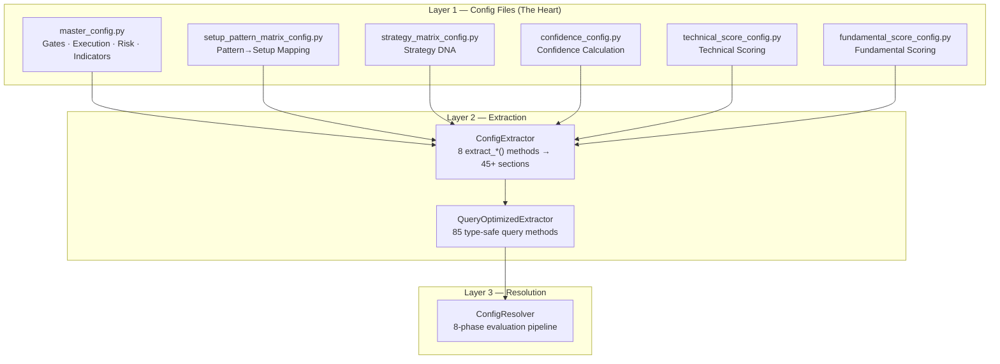

# Config System Architecture — Complete Reference

## System Overview

```
Raw OHLCV → Indicators → [Resolver 8-Phase Pipeline] → Trade Plan
                              ↑
                   Config System (this doc)
```

The config system has **4 layers**. Data flows top-down:



---

## Layer 1 — Config File Responsibilities

### 1. [master_config.py](file:///d:/stockviedeo/stock-analyzer-app/config/master_config.py) — **The Orchestrator's Rulebook**

**Owns:** Trade execution parameters, gate thresholds, risk management, indicator settings, and horizon-specific overrides.  
**Does NOT own:** Scoring logic, confidence calculation, strategy classification, or setup identification.

| Section | Scope | Purpose |
|---|---|---|
| `HYBRID_METRIC_REGISTRY` | Global (top-level) | Defines 7 hybrid metrics (fundamentalMomentum, trendConsistency, etc.) with scoring params |
| `HYBRID_PILLAR_COMPOSITION` | Per-horizon (top-level) | How the 7 hybrid metrics weight into the hybrid pillar per horizon |
| `HORIZON_PILLAR_WEIGHTS` | Per-horizon (top-level) | How tech/fund/hybrid pillars weight into the final score per horizon |
| `GATE_METRIC_REGISTRY` | Global (top-level) | Metadata for ~25 gate metrics — type, category, context_paths for value lookup |
| `global.entry_gates.structural` | Global | Universal structural gate thresholds (adx ≥18, trendStrength ≥3, etc.) |
| `global.entry_gates.execution_rules` | Global | Complex validation rules (volatility guards, structure validation, SL distance) |
| `global.entry_gates.opportunity` | Global | Post-confidence gates (confidence ≥55, rrRatio ≥1.5) |
| `global.calculation_engine.setup_classification` | Global | Signal classification thresholds per setup type (MOMENTUM_BREAKOUT, TREND_PULLBACK, etc.) |
| `global.calculation_engine.horizon_priority_overrides` | Per-horizon | Setup priority scores per horizon (determines which setup wins when multiple qualify) |
| `global.calculation_engine.spread_adjustment` | Global | Market-cap-based spread brackets |
| `global.calculation_engine.volume_signatures` | Global | Volume surge/drought/climax thresholds with confidence adjustments |
| `global.execution` | Global | SL/TP ATR multipliers, hold candles, structure validation tolerances |
| `global.risk_management` | Global | Risk per trade, position sizing, RR regime adjustments, RR gates |
| `global.position_sizing` | Global | Base risk %, setup multipliers, volatility adjustments |
| `global.volatility` | Global | ATR%/bbWidth scoring thresholds |
| `global.indicators` | Global | RSI/ADX/ATR periods, supertrend/bollinger/keltner params |
| `global.moving_averages` | Global | MA type, fast/mid/slow periods (EMA 20/50/200) |
| `global.boosts` | Global | Pattern/momentum/volatility/RS score boosts |
| `global.time_estimation` | Global | Hold time calculation params |
| `global.strategy_preferences` | Per-horizon | Horizon-level setup blocking/preference (which setups are allowed/preferred at this horizon) |
| `global.strategy_priority` | Per-horizon | Horizon-level strategy blocking/multipliers (which strategies are allowed/boosted at this horizon) |
| `global.divergence` | Global | Divergence detection thresholds and confidence penalties |
| `horizons.{h}.*` | Per-horizon | Horizon-specific overrides for all above (tighter/looser gate thresholds, different ATR mults, etc.) |

---

### 2. [setup_pattern_matrix_config.py](file:///d:/stockviedeo/stock-analyzer-app/config/setup_pattern_matrix_config.py) — **The Pattern Matchmaker**

**Owns:** Mapping patterns to setups, setup classification rules, per-setup gate requirements, per-setup horizon overrides.  
**Question it answers:** *"Given these detected patterns and indicator values, which setup(s) does this stock qualify for, and what are the specific requirements?"*

| Section | Purpose |
|---|---|
| `SETUP_PATTERN_MATRIX.{SETUP}.patterns` | PRIMARY/CONFIRMING/CONFLICTING pattern lists |
| `SETUP_PATTERN_MATRIX.{SETUP}.classification_rules` | Rules to detect this setup (indicator thresholds + pattern detection) |
| `SETUP_PATTERN_MATRIX.{SETUP}.context_requirements` | Setup-specific gate requirements (technical + fundamental) |
| `SETUP_PATTERN_MATRIX.{SETUP}.validation_modifiers` | Penalties and bonuses for pattern quality (e.g., weak breakout volume = -15) |
| `SETUP_PATTERN_MATRIX.{SETUP}.horizon_overrides.{h}` | Per-horizon override of context_requirements and opportunity gates |
| `PATTERN_METADATA.{pattern}` | Physics (speed_factor, duration_mult), entry rules, invalidation logic per pattern |
| `PATTERN_INDICATOR_MAPPINGS` | Horizon-aware indicator→pattern parameter mapping |
| `PATTERN_SCORING_THRESHOLDS` | Quality scoring thresholds per pattern |

---

### 3. [strategy_matrix_config.py](file:///d:/stockviedeo/stock-analyzer-app/config/strategy_matrix_config.py) — **The Strategy DNA Profiler**

**Owns:** Strategy identification, strategy-level scoring rules, strategy-level setup preferences, strategy-horizon fit multipliers.  
**Question it answers:** *"Given this stock's indicators/fundamentals, which investment strategy (swing, momentum, CANSLIM, value, etc.) best fits this stock?"*

| Section | Purpose |
|---|---|
| `STRATEGY_MATRIX.{strategy}.fit_indicators` | Weighted indicator thresholds for strategy fit score (0-100) |
| `STRATEGY_MATRIX.{strategy}.scoring_rules` | Condition-based bonus/penalty rules for strategy bonus score |
| `STRATEGY_MATRIX.{strategy}.preferred_setups` | Which setups this strategy prefers (strategy-level, not horizon-level) |
| `STRATEGY_MATRIX.{strategy}.avoid_setups` | Which setups this strategy avoids |
| `STRATEGY_MATRIX.{strategy}.horizon_fit_multipliers` | How well this strategy fits each horizon (0.0 = blocked, 1.3 = best fit) |
| `STRATEGY_MATRIX.{strategy}.market_cap_requirements` | Market cap gates per strategy |

> [!IMPORTANT]
> **Distinct from `master_config.strategy_preferences`:** Strategy matrix says "*this strategy likes these setups*" (strategy-level preference). Master config says "*this horizon blocks these setups*" (horizon-level enforcement). Different abstraction levels in the resolver hierarchy.

---

### 4. [confidence_config.py](file:///d:/stockviedeo/stock-analyzer-app/config/confidence_config.py) — **The Confidence Calculator**

**Owns:** All confidence calculation logic — base floors, ADX normalization, volume modifiers, divergence penalties, horizon-specific bonuses/penalties, clamps.  
**Question it answers:** *"Given this setup and market conditions, what is the confidence score (0-100)?"*

| Section | Purpose |
|---|---|
| `global.confidence_range` | Absolute min/max (0–100) and default clamp |
| `global.adx_normalization` | ADX normalization formula for cross-setup comparison |
| `global.volume_modifiers` | Volume surge bonus, drought penalty, climax warning |
| `global.universal_adjustments` | Divergence penalties (severe/moderate/minor) + trend strength bands |
| `global.setup_baseline_floors` | Base confidence floor per setup (MOMENTUM_BREAKOUT: 55, GENERIC: 40, etc.) |
| `global.divergence_physics` | Mathematical parameters for RSI/Price divergence detection |
| `horizons.{h}.confidence_clamp` | Horizon-specific [min, max] clamp |
| `horizons.{h}.base_confidence_adjustment` | Horizon-level adjustment (e.g., intraday = -10) |
| `horizons.{h}.setup_floor_overrides` | Horizon-specific override of setup baseline floors |
| `horizons.{h}.conditional_adjustments` | Horizon-specific penalties (weak_trend, low_liquidity) and bonuses (clean_breakout, volume_surge) |
| `horizons.{h}.adx_confidence_bands` | ADX-based confidence boost bands per horizon |
| `horizons.{h}.adx_confidence_penalties` | ADX-based confidence penalty per horizon |
| `horizons.{h}.min_tradeable_confidence` | Minimum confidence to mark as tradeable |
| `horizons.{h}.high_confidence_override` | High confidence override threshold |

> [!IMPORTANT]
> **Distinct from `master_config.divergence`:** Confidence config's divergence adjusts the *confidence score*. Master config's divergence (if used) would gate *trade entry permission*. Different pipeline phases.

---

### 5. [technical_score_config.py](file:///d:/stockviedeo/stock-analyzer-app/config/technical_score_config.py) — **The Technical Scorer**

**Owns:** How raw indicator values become scores (0-10), metric weights per horizon, and the scoring computation functions.

| Export | Purpose |
|---|---|
| `METRIC_REGISTRY` | Defines 40+ technical metrics with scoring_type (linear_range, stepped, mapping, passthrough) and params |
| `HORIZON_WEIGHTS` | Per-horizon category weights for aggregation (momentum, trend, volatility, volume, structure) |
| `calculate_dynamic_score()` | Function: scores a single metric value using its registry entry |
| `compute_technical_score()` | Function: computes the aggregated technical score for a given horizon |

---

### 6. [fundamental_score_config.py](file:///d:/stockviedeo/stock-analyzer-app/config/fundamental_score_config.py) — **The Fundamental Scorer**

**Owns:** Which fundamental metrics apply per horizon, category weights, per-metric weights, and scoring computation.

| Export | Purpose |
|---|---|
| `METRIC_REGISTRY` | Fundamental metric metadata (30+ metrics) |
| `HORIZON_METRIC_PARTICIPATION` | Which metrics are included/excluded per horizon |
| `HORIZON_FUNDAMENTAL_WEIGHTS` | Per-horizon category weights (valuation, profitability, growth, etc.) |
| `METRIC_WEIGHTS` | Per-metric weight within each category per horizon |
| `compute_fundamental_score()` | Function: computes the aggregated fundamental score |

---

## Layer 2 — Extraction Flow

### [ConfigExtractor](file:///d:/stockviedeo/stock-analyzer-app/config/config_extractor.py#58-1256) — 8 Extraction Methods

| Method | Reads From | Section Keys Created |
|---|---|---|
| [extract_global_sections()](file:///d:/stockviedeo/stock-analyzer-app/config/config_extractor.py#378-457) | [master_config](file:///d:/stockviedeo/stock-analyzer-app/config/config_extractor.py#291-373) global + top-level registries | `hybrid_metric_registry`, `hybrid_pillar_composition`, `horizon_pillar_weights`, `setup_classification`, `spread_adjustment`, `volume_signatures`, `position_sizing`, [risk_management](file:///d:/stockviedeo/stock-analyzer-app/config/config_extractor.py#954-967), `indicators`, [execution](file:///d:/stockviedeo/stock-analyzer-app/config/config_resolver.py#685-714), `trend_weights`, `moving_averages`, `volatility`, `boosts`, `targets`, `time_estimation` |
| [extract_horizon_sections()](file:///d:/stockviedeo/stock-analyzer-app/config/config_extractor.py#458-510) | [master_config](file:///d:/stockviedeo/stock-analyzer-app/config/config_extractor.py#291-373) horizons.{h} | `horizon_risk_management`, `horizon_execution`, `horizon_indicators`, `horizon_moving_averages`, `horizon_volatility`, `horizon_volume_analysis`, `horizon_time_estimation`, `enhancements`, `horizon_trend_thresholds`, `horizon_momentum_thresholds` |
| [extract_setup_sections()](file:///d:/stockviedeo/stock-analyzer-app/config/config_extractor.py#511-529) | [master_config](file:///d:/stockviedeo/stock-analyzer-app/config/config_extractor.py#291-373) global.calculation_engine | [horizon_priority_overrides](file:///d:/stockviedeo/stock-analyzer-app/config/config_extractor.py#1252-1256), `setup_classification_rules` |
| [extract_strategy_sections()](file:///d:/stockviedeo/stock-analyzer-app/config/config_extractor.py#530-579) | [master_config](file:///d:/stockviedeo/stock-analyzer-app/config/config_extractor.py#291-373) global strategy_preferences + strategy_priority | [blocked_setups](file:///d:/stockviedeo/stock-analyzer-app/config/config_extractor.py#1227-1231), [preferred_setups](file:///d:/stockviedeo/stock-analyzer-app/config/config_extractor.py#1232-1236), [sizing_multipliers](file:///d:/stockviedeo/stock-analyzer-app/config/config_extractor.py#1247-1251), `horizon_base_multiplier`, [blocked_strategies](file:///d:/stockviedeo/stock-analyzer-app/config/config_extractor.py#1237-1241), [strategy_multipliers](file:///d:/stockviedeo/stock-analyzer-app/config/config_extractor.py#1242-1246) |
| [extract_risk_sections()](file:///d:/stockviedeo/stock-analyzer-app/config/config_extractor.py#580-625) | [master_config](file:///d:/stockviedeo/stock-analyzer-app/config/config_extractor.py#291-373) global + horizon risk_management | `atr_sl_limits`, `rr_regime_adjustments`, `global_rr_gates`, `horizon_atr_sl_limits`, `horizon_rr_regime_adjustments`, `horizon_rr_gates`, `rr_gates` (merged) |
| [extract_gate_sections()](file:///d:/stockviedeo/stock-analyzer-app/config/config_extractor.py#626-691) | [master_config](file:///d:/stockviedeo/stock-analyzer-app/config/config_extractor.py#291-373) global + horizon entry_gates | `structural_gates`, `execution_rules`, `opportunity_gates`, `horizon_structural_gates`, `horizon_opportunity_gates`, `horizon_execution_rules` |
| [extract_matrix_sections()](file:///d:/stockviedeo/stock-analyzer-app/config/config_extractor.py#692-878) | `setup_pattern_matrix_config` + `strategy_matrix_config` | `setup_pattern_matrix`, `pattern_metadata`, `pattern_scoring_thresholds`, `pattern_indicator_mappings`, `default_physics`, `setup_{name}`, `setup_validation_{name}`, `pattern_{name}`, `pattern_physics_{name}`, `pattern_entry_{name}`, `pattern_invalidation_{name}`, `setup_context_{name}`, `setup_horizon_overrides_{name}`, [strategy_matrix](file:///d:/stockviedeo/stock-analyzer-app/config/strategy_matrix_config.py#770-797), `strategy_{name}`, `strategy_scoring_{name}` |
| [extract_confidence_sections()](file:///d:/stockviedeo/stock-analyzer-app/config/config_extractor.py#138-290) | `confidence_config` | [confidence_range](file:///d:/stockviedeo/stock-analyzer-app/config/query_optimized_extractor.py#104-121), `adx_normalization`, [volume_modifiers](file:///d:/stockviedeo/stock-analyzer-app/config/query_optimized_extractor.py#178-197), [universal_adjustments](file:///d:/stockviedeo/stock-analyzer-app/config/query_optimized_extractor.py#198-220), `setup_baseline_floors`, [divergence_physics](file:///d:/stockviedeo/stock-analyzer-app/config/query_optimized_extractor.py#274-284), `horizon_confidence_clamp`, `min_tradeable_confidence`, `high_confidence_override`, `horizon_confidence_philosophy`, `horizon_base_confidence_adjustment`, `horizon_setup_floor_overrides`, `horizon_conditional_adjustments`, `horizon_adx_confidence_bands`, `horizon_adx_confidence_penalties` |

---

## Layer 3 — Resolver Pipeline (8 Phases)

| Phase | Resolver Method | Key QOE Methods Called | Config Source |
|---|---|---|---|
| **1. Foundation** | [_calculate_all_scores()](file:///d:/stockviedeo/stock-analyzer-app/config/config_resolver.py#858-925) | `compute_technical_score()`, `compute_fundamental_score()`, `get_hybrid_metric_registry()`, `get_hybrid_pillar_composition()` | technical_score_config, fundamental_score_config, master_config |
| | [_build_conditions()](file:///d:/stockviedeo/stock-analyzer-app/config/config_resolver.py#1023-1065) | `get_setup_classification_rules()`, `get_execution_config()` | master_config |
| | `detect_volume_signature()` | [get_volume_modifiers()](file:///d:/stockviedeo/stock-analyzer-app/config/query_optimized_extractor.py#178-197) | confidence_config |
| | `detect_divergence()` | [get_divergence_physics()](file:///d:/stockviedeo/stock-analyzer-app/config/query_optimized_extractor.py#274-284), [get_universal_adjustments()](file:///d:/stockviedeo/stock-analyzer-app/config/query_optimized_extractor.py#198-220) | confidence_config |
| **2. Setup Classification** | [_classify_setup()](file:///d:/stockviedeo/stock-analyzer-app/config/config_resolver.py#1077-1264) | `get_setup_classification_rules()`, `get_setup_priority()`, `get_all_setup_names()`, `get_setup_context_requirements()` | master_config, setup_pattern_matrix_config |
| **3. Pattern Validation** | `_validate_patterns()` | `get_pattern_metadata()`, `get_pattern_physics()` | setup_pattern_matrix_config |
| **4. Strategy & Preferences** | `_classify_strategy()` | `get_all_strategy_configs()`, [get_strategy_horizon_multiplier()](file:///d:/stockviedeo/stock-analyzer-app/config/strategy_matrix_config.py#698-708), strategy scoring | strategy_matrix_config |
| | `_apply_setup_preferences()` | `get_blocked_setups()`, `get_preferred_setups()`, `get_strategy_multipliers()` | master_config |
| **5. Structural Gates** | `_validate_structural_gates()` | `get_resolved_structural_gates()` | master_config (global + horizon + setup_pattern_matrix overrides) |
| **6. Execution Rules** | `_validate_execution_rules()` | `get_execution_rules()` | master_config |
| **7. Confidence** | `_calculate_confidence()` | [get_setup_baseline_floor()](file:///d:/stockviedeo/stock-analyzer-app/config/query_optimized_extractor.py#143-168), [get_base_confidence_adjustment()](file:///d:/stockviedeo/stock-analyzer-app/config/query_optimized_extractor.py#169-177), [get_adx_confidence_bands()](file:///d:/stockviedeo/stock-analyzer-app/config/query_optimized_extractor.py#245-262), [get_conditional_adjustments()](file:///d:/stockviedeo/stock-analyzer-app/config/query_optimized_extractor.py#221-244), [get_confidence_clamp()](file:///d:/stockviedeo/stock-analyzer-app/config/query_optimized_extractor.py#122-141) | confidence_config |
| **8. Opportunity Gates** | `_validate_opportunity_gates()` | `get_resolved_opportunity_gates()` | master_config (global + horizon overrides) |

---

## Key Architectural Principles

### 1. Layered Responsibility

```
setup_pattern_matrix → "Does this pattern qualify as Setup X?"     (IDENTIFICATION)
strategy_matrix      → "What strategy fits this stock?"            (CLASSIFICATION)
confidence_config    → "How confident are we in this setup?"       (SCORING)
master_config        → "Can we actually execute this trade?"       (EXECUTION)
```

### 2. Merge Hierarchy (Global → Horizon → Setup)

The QOE's [get_merged()](file:///d:/stockviedeo/stock-analyzer-app/config/config_extractor.py#1105-1125) method resolves conflicts:
- **Global defaults** provide the baseline
- **Horizon overrides** tighten or loosen for the timeframe
- **Setup overrides** (from setup_pattern_matrix) apply setup-specific requirements

### 3. Data Never Flows Backwards

- Confidence config does NOT read from master_config
- Strategy matrix does NOT read from setup_pattern_matrix
- Each config is self-contained
- **Only the resolver** crosses boundaries by calling QOE methods from different configs
